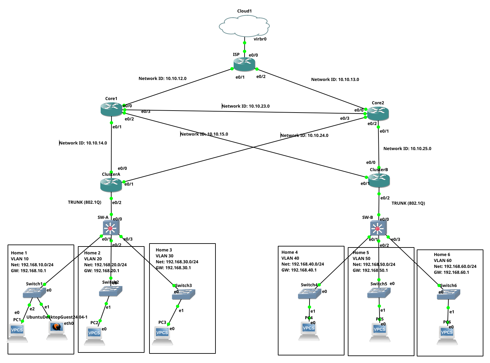
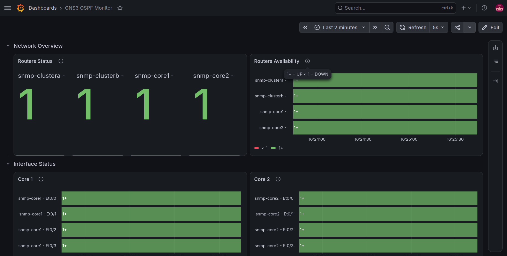
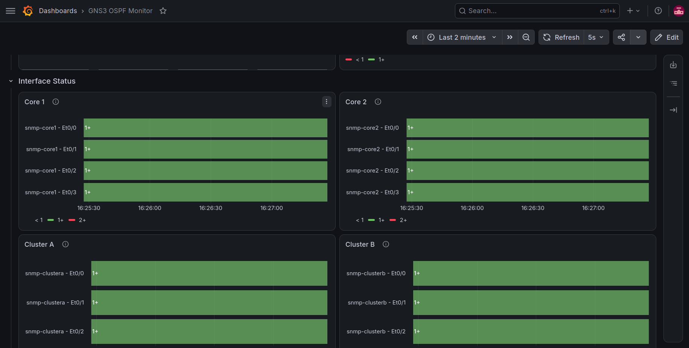
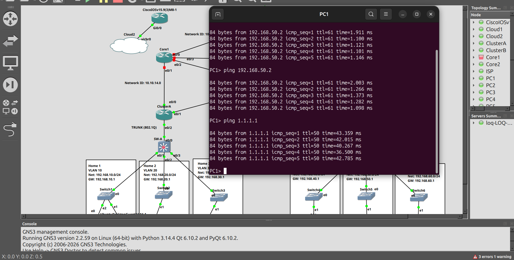
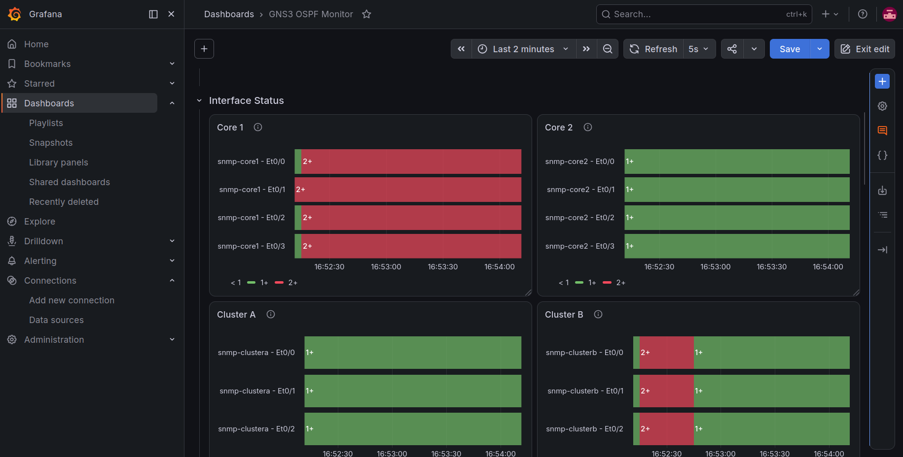

# GNS3 OSPF Network Monitoring with Prometheus & Grafana

A network monitoring project that simulates an enterprise OSPF topology in GNS3 and visualizes router and interface health using Prometheus, SNMP Exporter, and Grafana.

---

## Overview

This project demonstrates how Prometheus and Grafana can be used to monitor a simulated enterprise network running OSPF.

The monitoring system collects SNMP interface metrics from Cisco IOU routers and displays them in Grafana dashboards for real-time visualization.

The project also includes failure testing to verify that routing reconverges correctly while monitoring reflects interface status changes.

---

## Features

- OSPF multi-router topology in GNS3
- SNMP monitoring
- Prometheus metric collection
- Grafana dashboards
- Interface status monitoring
- Link availability monitoring
- Traffic monitoring
- OSPF failover testing
- Docker Compose deployment

---

## Technologies

- GNS3
- Cisco IOU
- OSPF
- SNMP v2c
- Prometheus
- SNMP Exporter
- Grafana
- Docker Compose
- Ubuntu Linux

---

## Network Topology



---

## Dashboard Preview

### Overview Dashboard



### Interface Monitoring



### Link Monitoring


---

## Failure Test

### Scenario

Core1 interface was administratively shut down.

Observed results:

- Interface status changed to Down
- Prometheus detected status changes
- Grafana updated automatically
- OSPF reconverged
- End-to-end connectivity remained available through an alternate path

### Test Evidence

Ping Test



Grafana Detection



---

## Project Structure

```
gns3-ospf-monitoring/
├── docker-compose.yml
├── prometheus.yml
├── grafana/
│   ├── dashboards/
│   └── screenshots/
├── topology-screenshots/
│   ├── Script/
├── docs/
└── README.md
```

---

## Running the Project

Clone the repository

```bash
git clone https://github.com/Luxbane/gns3-ospf-monitoring.git
cd gns3-ospf-monitoring
```

Start Docker services

```bash
docker compose up -d
```

Open

- Grafana: http://localhost:3000
- Prometheus: http://localhost:9090

---

## Future Improvements

- CPU monitoring
- Memory monitoring
- Alertmanager integration
- Email notifications
- Telegram notifications
- Packet loss monitoring
- Network latency dashboard
- NetFlow monitoring


