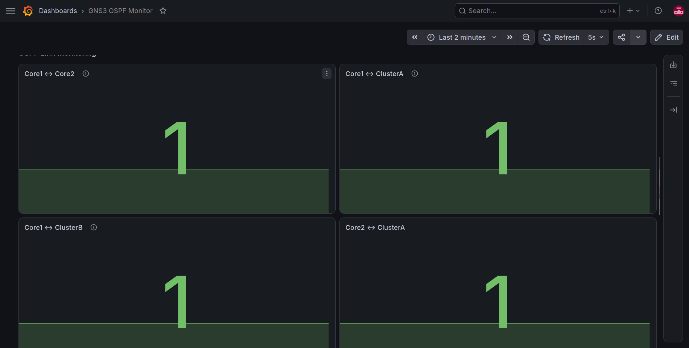

# GNS3 OSPF Network Monitoring with Prometheus & Grafana

A network monitoring project that simulates an enterprise OSPF topology in GNS3 and visualizes router and interface health using Prometheus, SNMP Exporter, and Grafana.

---

## Overview

This project demonstrates how Prometheus and Grafana can be used to monitor a simulated enterprise network running OSPF.

The monitoring system collects SNMP interface metrics from Cisco IOU routers and displays them in Grafana dashboards for real-time visualization.

The project also includes failure testing to verify that routing reconverges correctly while monitoring reflects interface status changes.

---

## Features

- OSPF multi-router topology in GNS3
- SNMP monitoring
- Prometheus metric collection
- Grafana dashboards
- Interface status monitoring
- Link availability monitoring
- Traffic monitoring
- OSPF failover testing
- Docker Compose deployment

---

## Technologies

- GNS3
- Cisco IOU
- OSPF
- SNMP v2c
- Prometheus
- SNMP Exporter
- Grafana
- Docker Compose
- Ubuntu Linux

---

## Network Topology


---

## Dashboard Preview

### Overview Dashboard


### Interface Monitoring


### Link Monitoring



---

## Failure Test

### Scenario

Core1 interface was administratively shut down.

Observed results:

- Interface status changed to Down
- Prometheus detected status changes
- Grafana updated automatically
- OSPF reconverged
- End-to-end connectivity remained available through an alternate path

### Test Evidence

Ping Test


Grafana Detection


---

## Project Structure

```
gns3-ospf-monitoring/
├── docker-compose.yml
├── prometheus.yml
├── grafana/
│   ├── dashboards/
│   └── screenshots/
├── topology-screenshots/
│   ├── Script/
├── docs/
└── README.md
```

---

## Requirements

- GNS3
- Cisco Router & L2 Switch images (Please use your own legally obtained router and switch images compatible with GNS3.)
- Docker Engine
- Docker Compose
- Git (optional)

---

## Installation

Clone repository

```bash
git clone git@github.com:Luxbane/gns3-ospf-monitoring.git
cd gns3-ospf-monitoring
```

Start monitoring stack

```bash
docker compose up -d
```

Verify containers

```bash
docker ps
```

Open services

Grafana
http://localhost:3000

Prometheus
http://localhost:9090

SNMP Exporter
http://localhost:9116

---

## Import Dashboard

1. Login Grafana
2. Add Prometheus datasource
3. Import dashboard from

```
grafana/dashboards/GNS3 OSPF Monitor.json
```

---

## Configure Prometheus

Edit

```
prometheus.yml
```

Replace the router IP addresses with your own GNS3 topology.

Restart Prometheus

```bash
docker compose restart prometheus
```

---

## Testing

- Ping between VLANs
- Shut down Core1 e0/0
- Observe interface status changes in Grafana
- Verify OSPF reroutes traffic
- Bring interface back up---

## Future Improvements

- CPU monitoring
- Memory monitoring
- Alertmanager integration
- Email notifications
- Telegram notifications
- Packet loss monitoring
- Network latency dashboard
- NetFlow monitoring


